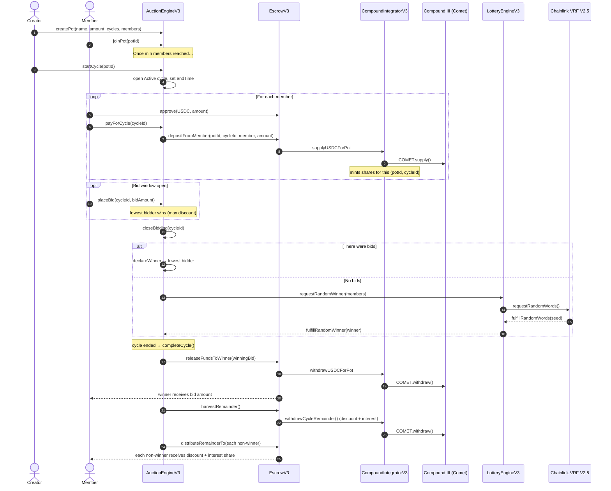
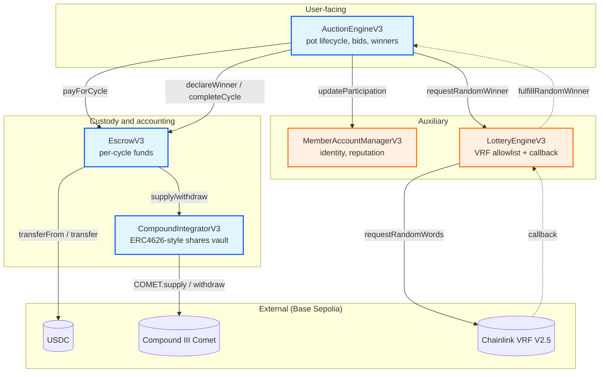
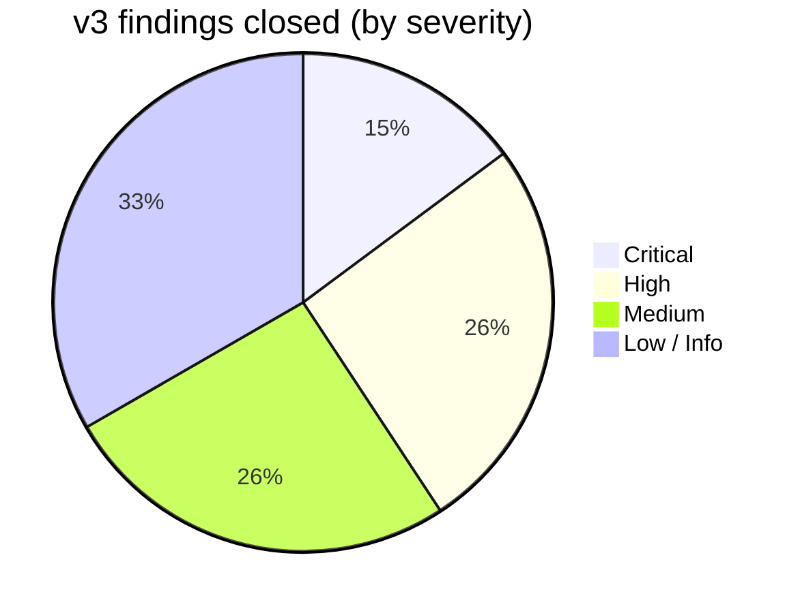
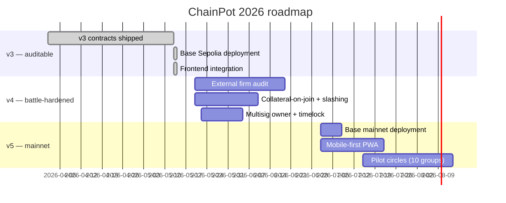

# ChainPot

> A trust-minimized, yield-bearing rotating savings circle for the people the financial system forgot.

[](LICENSE)
[](smart-contracts/v3/)
[](smart-contracts/v3/)
[](https://sepolia.basescan.org/)
[](smart-contracts/v3/test/)
[](audit_Report.md)

---

## Why ChainPot exists

Two billion people on this planet save and borrow through **rotating savings and credit associations** — *chit funds* in India, *susus* in West Africa, *paluwagans* in the Philippines, *tandas* in Mexico, *kyes* in Korea. They're older than banks. They work because the people inside the circle know and trust each other.

But trust at scale is hard. Organizers run away with the pot. Members default. Discount math is opaque. Idle deposits earn nothing. Lawsuits go nowhere because the agreements aren't enforceable.

**ChainPot puts the chit fund inside a smart contract.** Contributions, bids, and discount payouts are pure code on Base. Idle pot funds earn Compound III yield while waiting their turn. Winner selection is either an open auction or Chainlink-VRF-verifiable randomness. No organizer can disappear. No accounting can hide. Members of a circle still know each other — the protocol just stops being a place where trust gets exploited.

---

## How a single cycle plays out



Read that carefully — step 19 is the heart of the protocol. The winner takes their bid; **the difference between the pool and the bid (the *discount*) plus all Compound interest is split pro-rata among the members who didn't win**. That's what makes the bidding mechanism actually function: lower bids return more money to your neighbors, and they will return the favor on their cycle.

---

## Architecture

Five contracts, single responsibility each, wired through `Ownable` and access-controlled cross-references.



| Contract | Job | Key v3 innovation |
|---|---|---|
| **AuctionEngineV3** | Pot CRUD, cycle state machine, bidding, winner declaration, payout orchestration | Sequential cycles, creator-grace fallback, CEI-correct VRF, member-validated callback, discount distribution loop |
| **EscrowV3** | Holds USDC, talks to integrator, executes payouts | Direct member→escrow transfers (no AuctionEngine middleman), `harvestRemainder` for cycle wrap-up |
| **CompoundIntegratorV3** | ERC4626-style shares vault over Comet | Per-cycle share accounting; deposits and withdrawals never leak interest across cycles |
| **MemberAccountManagerV3** | Member registration, participation history, reputation score | Self-registration only; default penalty hook; pot-leave cleanup |
| **LotteryEngineV3** | Chainlink VRF gateway | Allowlist on `requestRandomWinner` (VRF subscription un-drainable); max-participants cap; callback gas raised |

---

## v3 audit-fix highlights

This codebase ships after an independent audit that found **two critical bugs the prior audits missed**. See [`audit_Report.md`](audit_Report.md) for the full report; the headlines:



- **C-01 — Discount never distributed.** In prior versions, the winner took their bid and the discount (pool − bid) was stranded in Compound forever. v3 ships `EscrowV3.harvestRemainder` + `AuctionEngineV3.completeCycle` that distribute discount + interest pro-rata to non-winners. **This is the ROSCA's reason to exist.**
- **C-02 / C-04 — Interest math was broken.** The prior pro-rata-of-balance accounting silently misallocated interest across cycles and accumulated stuck principal. v3 uses ERC4626-style shares.
- **C-03 — VRF subscription drainable.** Anyone could call `requestRandomWinner` on the old `LotteryEngine` and burn LINK. v3 adds `authorizedRequesters`.
- **H-01 / H-03 — Creator-as-single-point-of-failure.** Cycles could permanently stall on a missing pot creator. v3 lets any member drive the cycle past a grace period.
- **H-05 — Unverified VRF winner.** v3 enforces `winner ∈ pot.members` in the callback path.

34 / 34 Foundry tests pass, including the integration tests that prove C-01 and C-02 end-to-end.

---

## Live on Base Sepolia

| Contract | Address |
|---|---|
| MemberAccountManagerV3 | `0x570B34fd586ef4FeFD9884F3b8D47555D4990De3` |
| LotteryEngineV3 | `0x17313EA008bA8FC7Ceb58D64C6cE549b723c0A0c` |
| CompoundIntegratorV3 | `0xcCfb46105d72eAD3a771687D7499cA1737075B0a` |
| EscrowV3 | `0x47a90F4df79afF2fe837B532c84742d83F4B2ca7` |
| AuctionEngineV3 | `0x904214aDEd4A24c5a6Fd918908CcC07Ab8CF455B` |

External deps: USDC `0x036C…F7e`, Comet USDC `0x5716…f017`, Chainlink VRF V2.5 Coordinator `0x5C21…7BEE`.

---

## Repository layout

```
chainpot/
├── README.md                  ← you are here
├── userpersona.md             ← who we're building for, and how they use ChainPot
├── audit_Report.md            ← v3 security audit (4 Critical, 7 High closed)
├── Frontend/                  ← Next.js + wagmi + RainbowKit dApp
│   ├── app/                   ← App Router pages (/, /dashboard, /pots, /pots/[id], /pots/create)
│   ├── components/            ← UI: pot cards, bidding section, dashboard widgets
│   ├── config/hooksConf.ts    ← v3 contract addresses + ABIs (single source of truth)
│   ├── hooks/                 ← wagmi hooks per contract
│   └── providers/             ← wallet provider, theme provider
└── smart-contracts/
    ├── README.md              ← contract-developer docs
    ├── AUDIT_REPORT.md        ← v1 audit (historical)
    ├── AUDIT_REPORT_v2.md     ← v2 audit (historical)
    ├── AUDIT_REPORT_v3.md     ← v3 audit (== audit_Report.md at root)
    ├── src/                   ← legacy v2 contracts (kept for reference)
    └── v3/
        ├── DEPLOYMENT.md      ← deployment record + audit-fix matrix
        ├── foundry.toml
        ├── src/               ← 5 production contracts, fully audited
        ├── test/              ← 5 test suites, 34 tests, with mocks
        ├── script/DeployV3.s.sol
        └── lib/               ← OpenZeppelin v5 + Chainlink + forge-std (gitignored)
```

---

## Getting started

### Smart contracts

```bash
cd smart-contracts/v3
forge build
forge test                                # 34 / 34 tests
```

Deploying a fresh copy:

```bash
cp /dev/null .env
# Add to .env:
#   PRIVATE_KEY=0x...                    (deployer)
#   USDC_BASE_SEPOLIA=0x036CbD53842c5426634e7929541eC2318f3dCF7e
#   COMET_USDC_BASE_SEPOLIA=0x571621Ce60Cebb0c1D442B5afb38B1663C6Bf017
#   VRF_COORDINATOR_BASE_SEPOLIA=0x5C210eF41CD1a72de73bF76eC39637bB0d3d7BEE
#   VRF_KEYHASH_BASE_SEPOLIA=0x9e1344a1247c8a1785d0a4681a27152bffdb43666ae5bf7d14d24a5efd44bf71
#   VRF_SUBSCRIPTION_ID=<your-sub-id>

set -a && source .env && set +a
forge script script/DeployV3.s.sol:DeployV3 \
  --rpc-url https://sepolia.base.org \
  --broadcast --slow
```

Then add the deployed `LotteryEngineV3` as a consumer on your Chainlink VRF subscription.

### Frontend

```bash
cd Frontend
npm install
npm run dev                              # http://localhost:3000
```

The frontend hard-codes the active Base Sepolia v3 addresses in `config/hooksConf.ts`. Repointing at a different deployment is a single-file edit.

---

## Status & roadmap



---

## Contributing

Contributions are welcome. Please:

1. Open an issue describing the change before sending a PR.
2. Run `forge test` (must stay 34/34) and `npm run build` in `Frontend/` (must stay green).
3. Keep `v3/` immutable — if you're changing contract logic, ship a `v4/` and update the audit report.

See `LICENSE` for terms.

---

## Acknowledgements

- The **Compound** team for Compound III — clean per-account accounting that makes integrations like this possible.
- **Chainlink VRF V2.5** for the only verifiable-randomness primitive that holds up against on-chain adversaries.
- **OpenZeppelin** for Pausable / ReentrancyGuard / SafeERC20 / EnumerableSet — boring infrastructure, done right.
- The people running real chit funds for the last two centuries, whose social engineering we're trying to encode without ruining.
