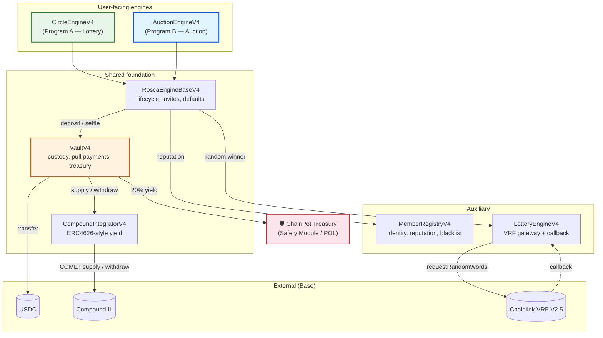
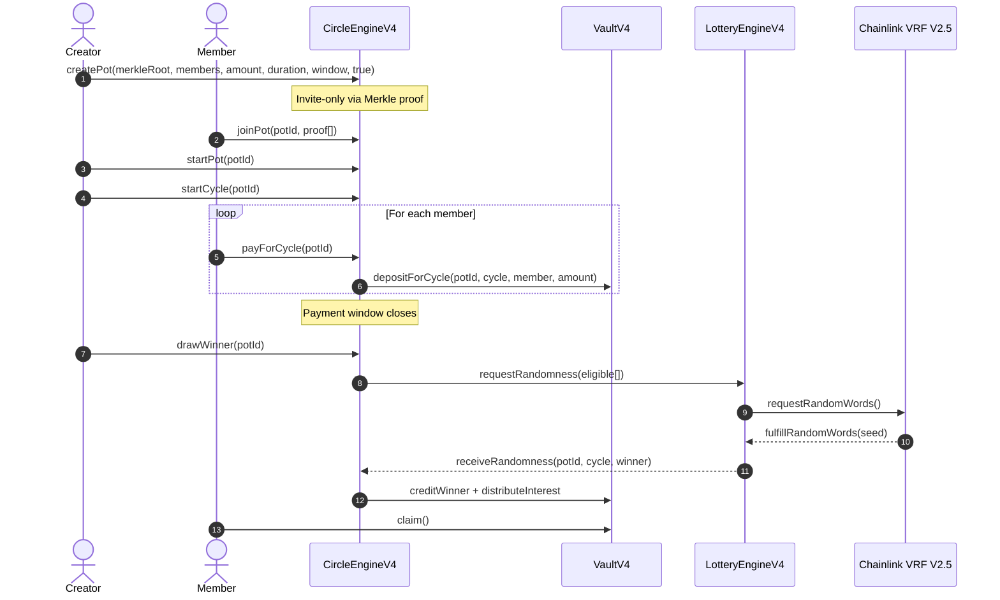
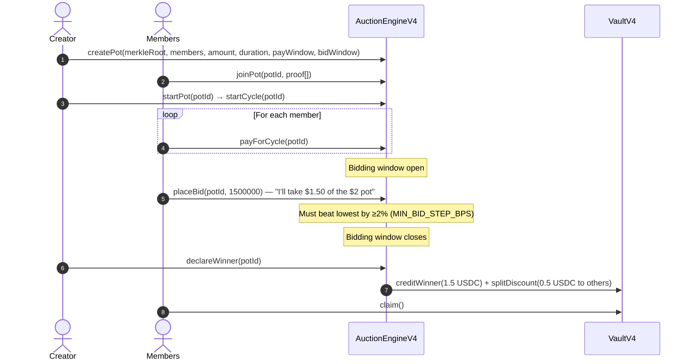
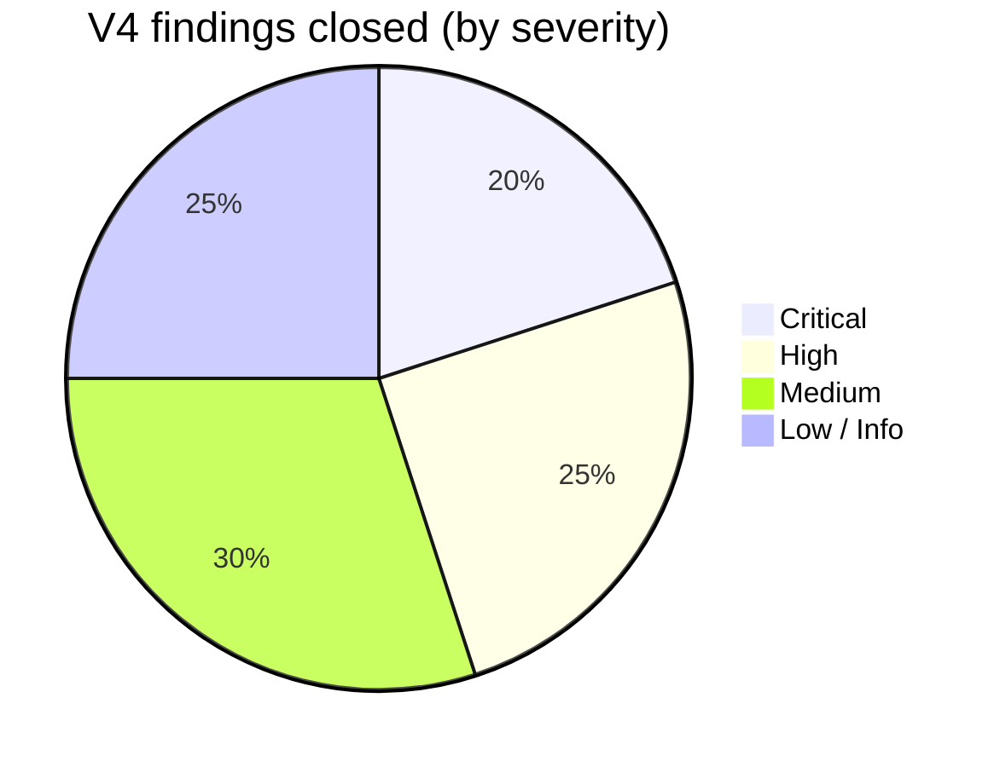
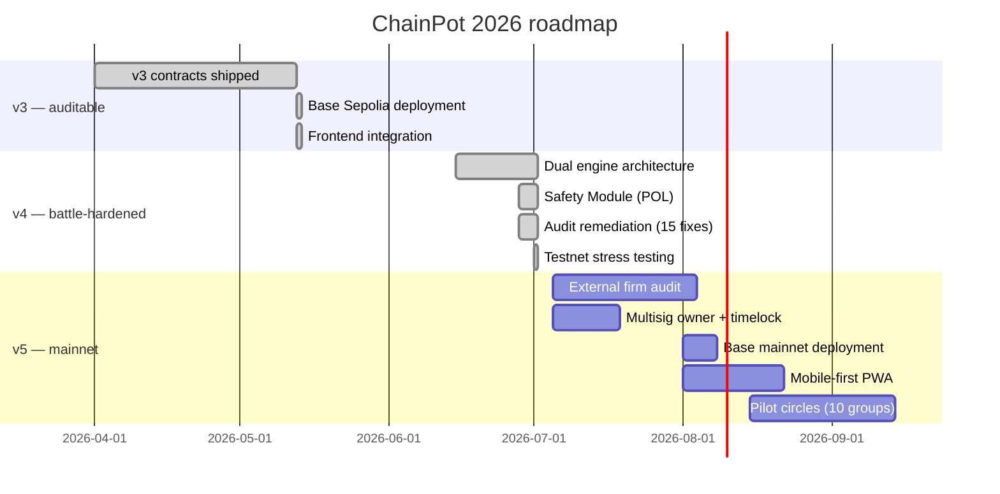

# ChainPot

> A trust-minimized, yield-bearing rotating savings protocol with two engines — community kitty parties and business ROSCAs — built for the people the financial system forgot.

[](LICENSE)
[](smart-contracts/v4/)
[](smart-contracts/v4/)
[](https://sepolia.basescan.org/)
[](smart-contracts/v4/test/)
[](audit_Report.md)

---

## Why ChainPot exists

Two billion people on this planet save and borrow through **rotating savings and credit associations** — *chit funds* in India, *susus* in West Africa, *paluwagans* in the Philippines, *tandas* in Mexico, *kyes* in Korea. They're older than banks. They work because the people inside the circle know and trust each other.

But trust at scale is hard. Organizers run away with the pot. Members default. Discount math is opaque. Idle deposits earn nothing. Lawsuits go nowhere because the agreements aren't enforceable.

**ChainPot puts the chit fund inside a smart contract.** Contributions, bids, and payouts are pure code on Base. Idle pot funds earn Compound III yield while waiting their turn. A **ChainPot Safety Module** captures 20% of all yield into Protocol Owned Liquidity, building an insurance backstop that scales with TVL. Winner selection is either a **Chainlink VRF lottery** (community circles) or a **competitive discount auction** (business ROSCAs). No organizer can disappear. No accounting can hide.

---

## Two engines, one protocol

ChainPot V4 ships with two distinct engines sitting on top of the same audited, battle-tested foundation:

### 🎲 Program A — CircleEngineV4 (Community Kitty Parties)

For social groups, families, friends, and trusted communities. Members contribute a flat USDC amount each cycle; the winner is selected by **Chainlink VRF verifiable randomness**. Fair, fun, and frictionless — nobody has to out-bid each other or do financial math.

### 🏦 Program B — AuctionEngineV4 (Business ROSCAs)

For businesses, SMEs, and professionals who use ROSCAs as a serious liquidity and credit tool. Members bid competitively in a **lowest-bid discount auction**. The lowest bidder takes the pot early at a discount; the remaining USDC (discount + Compound interest) is distributed as dividends to patient members. Acts as a decentralized credit market.



---

## How a cycle plays out

### Program A — Circle (Lottery)



### Program B — Auction (Discount Bid)



---

## Architecture

Seven contracts, single responsibility each:

| Contract | Job | Key V4 innovation |
|---|---|---|
| **RoscaEngineBaseV4** | Shared lifecycle: pot CRUD, cycle state machine, Merkle invite gate, payment tracking, default engine, VRF integration | Frozen roster, invite-only via Merkle proof, zero collateral with social trust, VRF timeout + retry logic |
| **CircleEngineV4** | Program A: lottery-based winner selection | Chainlink VRF randomness, eligible-member filtering, shuffle seed for future ordering |
| **AuctionEngineV4** | Program B: lowest-bid discount auction | 2% min bid step (M-03), strictly-lower re-bids (M-01), `totalCollected` ceiling (H-03), VRF fallback for no-bid cycles |
| **VaultV4** | Custody, pull payments, treasury yield capture | 20% yield → Safety Module (POL), `withdrawable` ledger, `rescueSurplus` with timelock |
| **CompoundIntegratorV4** | ERC4626-style shares vault over Comet | Per-cycle share accounting, virtual offset against inflation attacks (H-05) |
| **MemberRegistryV4** | Identity, reputation scoring, blacklist | Self-registration, creator profiles, bid history tracking (M-02), permanent blacklist on default |
| **LotteryEngineV4** | Chainlink VRF gateway | `authorizedRequesters` allowlist (C-03), max-participants cap, configurable callback gas |

---

## Security model — "ChainPot for Trusted Communities"

V4 is deliberately designed as **zero-collateral, invite-only** — optimized for viral growth and social trust over heavy DeFi collateral requirements:

| Layer | Mechanism |
|---|---|
| **Access control** | Merkle-root invite gate — only the creator's whitelist can join a pot |
| **Default deterrence** | Reputation scoring + permanent blacklist across the entire protocol |
| **Social enforcement** | Creator invites real people; defaults destroy real relationships |
| **Protocol insurance** | ChainPot Safety Module captures 20% of all Compound yield into Protocol Owned Liquidity |
| **Fund custody** | Pull-only `VaultV4` — no human signer can drain funds; engines can only credit, never transfer |
| **Randomness** | Chainlink VRF V2.5 — off-chain, verifiable, manipulation-proof |
| **Admin safety** | Pausable, ReentrancyGuard, owner-only config; production target is multisig + timelock |

---

## V4 audit remediations

V4 ships after two rounds of independent audit across 15 findings. Every finding is closed with tests:



Key fixes:
- **C-01** — Merkle invite gate + frozen roster + default→slash/blacklist (zero collateral, social trust model)
- **C-02** — VRF economic gate: 0 eligible→early complete, 1→direct assign, ≥2→VRF
- **H-01/H-02** — `hasWonInPot` prevents re-winning; eligible filtering excludes winners and defaulters
- **H-03** — Bid ceiling = `cycle.totalCollected` (actual deposits, not hopeful max)
- **H-04** — Pull-only payments; blacklisted recipients cannot brick finalization
- **H-05** — ERC4626 virtual offset against inflation/donation attacks
- **M-01/M-03** — Strictly-lower bids with 2% minimum step; no bid manipulation
- **M-06** — Hard payment deadline enforcement

18 / 18 Foundry tests pass, including full lifecycle and fork tests against real Compound III.

---

## Live on Base Sepolia (Testnet-Proven)

Both engines have been deployed and **stress-tested with live transactions** on Base Sepolia:

| Contract | Address |
|---|---|
| MemberRegistryV4 | `0xC4222C81B1ceF982F55477916a87C99Faaf9E8E2` |
| LotteryEngineV4 | `0x8327B810cea3E7B05A032448eED12D781c154880` |
| CompoundIntegratorV4 | `0x3D05DEa397e7778C5d453Fc8F8DeD3eaCDb8D23e` |
| VaultV4 | `0x0593a9EA617796Dd44f347331ff2CF60d4117136` |
| CircleEngineV4 (Program A) | `0x93cdC00c3759c9ed6427612f5FC9C943cB67755C` |
| AuctionEngineV4 (Program B) | `0x4d79Fc691269E43bBA513320fAAd2Ca9EeCe0394` |

External deps: USDC `0x036C…F7e`, Comet USDC `0x5716…f017`, Chainlink VRF V2.5 Coordinator `0x5C21…7BEE`.

**Testnet verification completed:**
- ✅ Full CircleEngineV4 lifecycle: create → join → fund → drawWinner → VRF callback
- ✅ Full AuctionEngineV4 lifecycle: create → join → fund → placeBid → declareWinner → settlement
- ✅ Merkle invite gate blocks unauthorized wallets
- ✅ MemberRegistryV4 reputation scoring on registration
- ✅ VaultV4 deposit and pull-payment flow
- ✅ Chainlink VRF request successfully sent and fulfilled

---

## Repository layout

```
chainpot/
├── README.md                  ← you are here
├── userpersona.md             ← who we're building for, and how they use ChainPot
├── audit_Report.md            ← security audit report
├── findings.md                ← detailed findings breakdown
├── Frontend/                  ← Next.js + wagmi + RainbowKit dApp
│   ├── app/                   ← App Router pages
│   ├── components/            ← UI components
│   ├── config/hooksConf.ts    ← contract addresses + ABIs
│   ├── hooks/                 ← wagmi hooks per contract
│   └── providers/             ← wallet provider, theme provider
└── smart-contracts/
    ├── src/                   ← legacy v2 contracts (kept for reference)
    ├── v3/                    ← v3 contracts (historical, audited)
    └── v4/                    ← ★ current production contracts
        ├── DEPLOYMENT.md      ← deployment record + audit-fix matrix
        ├── foundry.toml
        ├── src/               ← 7 production contracts
        │   ├── RoscaEngineBaseV4.sol    ← shared lifecycle
        │   ├── CircleEngineV4.sol       ← Program A (lottery)
        │   ├── AuctionEngineV4.sol      ← Program B (auction)
        │   ├── VaultV4.sol              ← custody + treasury
        │   ├── CompoundIntegratorV4.sol ← yield engine
        │   ├── MemberRegistryV4.sol     ← identity + reputation
        │   └── LotteryEngineV4.sol      ← VRF gateway
        ├── test/              ← 18 tests, with mocks
        ├── script/            ← deploy + testnet lifecycle scripts
        └── lib/               ← OpenZeppelin v5 + Chainlink + forge-std
```

---

## Getting started

### Smart contracts

```bash
cd smart-contracts/v4
forge build
forge test                                # 18 / 18 tests
```

Fork test against real Compound III on Base mainnet:

```bash
forge test --match-contract ForkCometTest --fork-url https://mainnet.base.org -vv
```

Deploying a fresh copy:

```bash
cp /dev/null .env
# Add to .env:
#   PRIVATE_KEY=0x...
#   USDC_BASE_SEPOLIA=0x036CbD53842c5426634e7929541eC2318f3dCF7e
#   COMET_USDC_BASE_SEPOLIA=0x571621Ce60Cebb0c1D442B5afb38B1663C6Bf017
#   VRF_COORDINATOR_BASE_SEPOLIA=0x5C210eF41CD1a72de73bF76eC39637bB0d3d7BEE
#   VRF_KEYHASH_BASE_SEPOLIA=0x9e1344a1247c8a1785d0a4681a27152bffdb43666ae5bf7d14d24a5efd44bf71
#   VRF_SUBSCRIPTION_ID=<your-sub-id>

set -a && source .env && set +a
forge script script/DeployV4.s.sol:DeployV4 \
  --rpc-url https://sepolia.base.org \
  --broadcast --slow
```

Then add the deployed `LotteryEngineV4` as a consumer on your Chainlink VRF subscription.

### Frontend

```bash
cd Frontend
npm install
npm run dev                              # http://localhost:3000
```

The frontend hard-codes active contract addresses in `config/hooksConf.ts`. Repointing at the V4 deployment is a single-file edit.

---

## Status & roadmap



---

## Contributing

Contributions are welcome. Please:

1. Open an issue describing the change before sending a PR.
2. Run `forge test` (must stay 18/18) and `npm run build` in `Frontend/` (must stay green).
3. Keep `v4/` contracts stable — if you're changing core logic, document the change and update the audit report.

See `LICENSE` for terms.

---

## Acknowledgements

- The **Compound** team for Compound III — clean per-account accounting that makes integrations like this possible.
- **Chainlink VRF V2.5** for the only verifiable-randomness primitive that holds up against on-chain adversaries.
- **OpenZeppelin** for Pausable / ReentrancyGuard / SafeERC20 / MerkleProof — boring infrastructure, done right.
- The people running real chit funds for the last two centuries, whose social engineering we're trying to encode without ruining.
