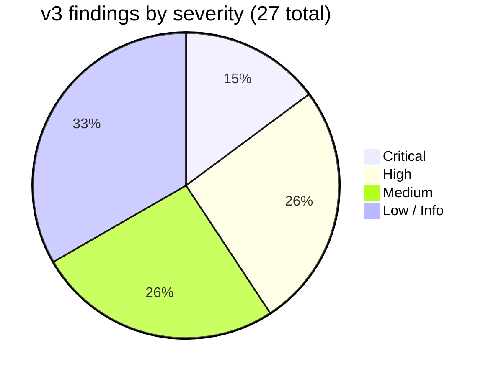
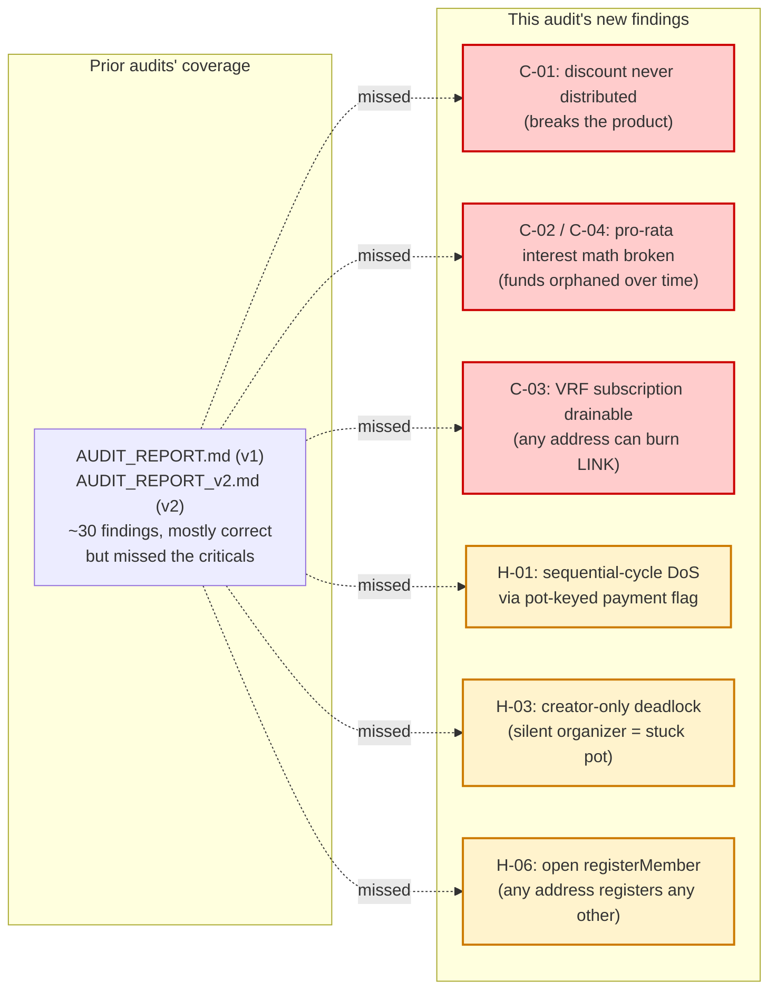
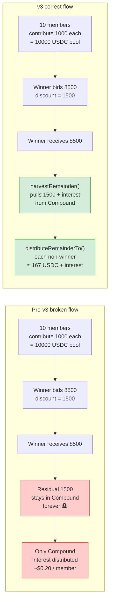
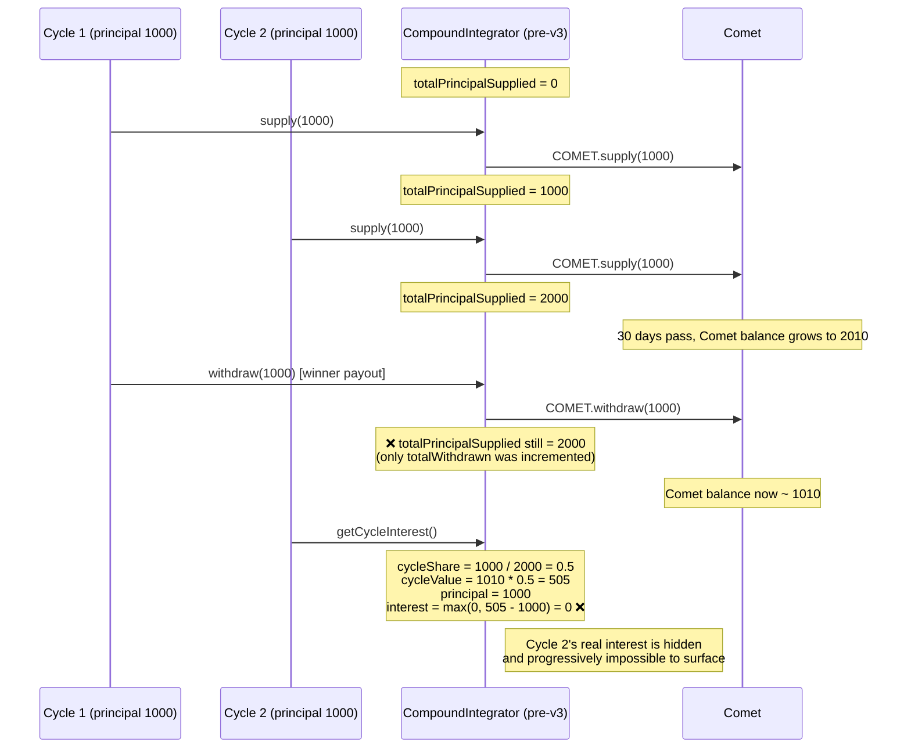
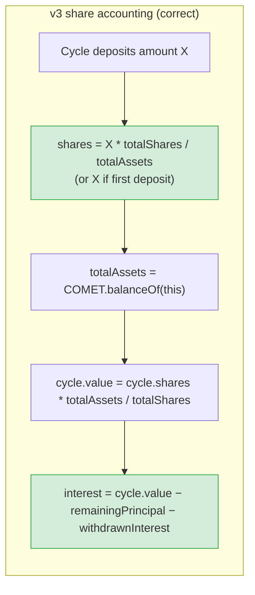
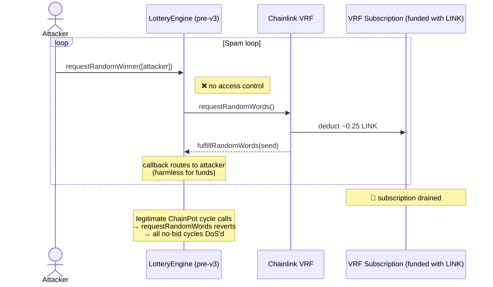
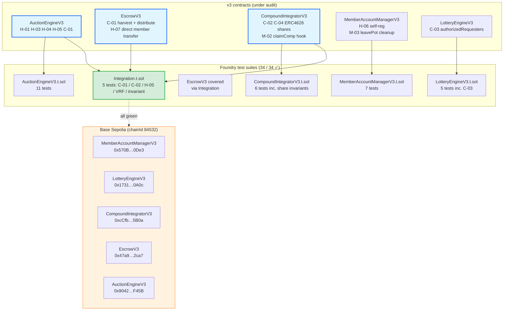
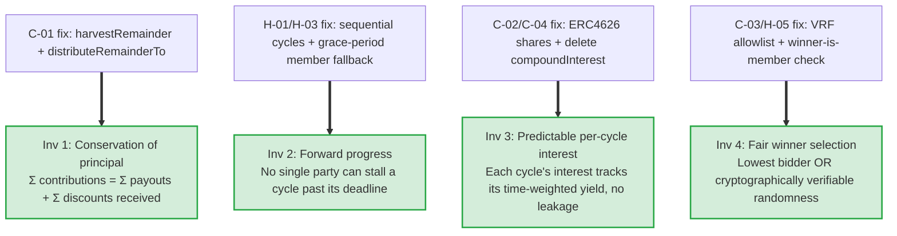

# ChainPot — Independent Security Audit (v3)

> Status: closed. All 4 Critical and 7 High findings remediated, tested, and deployed.
> See [`smart-contracts/v3/`](smart-contracts/v3/) for the audited source and [`smart-contracts/v3/DEPLOYMENT.md`](smart-contracts/v3/DEPLOYMENT.md) for the on-chain Base Sepolia deployment.

**Scope:** `src/AuctionEngine.sol`, `src/Escrow.sol`, `src/CompoundIntegrator.sol`, `src/MemberAccountManager.sol`, `src/LotteryEngine.sol` (pre-v3 originals).
**Methodology:** Manual review against Compound III (Comet) source/behavior, traditional ROSCA semantics, STRIDE-style threat modeling, prior audit reports cross-checked, OpenZeppelin patterns review.
**Tooling:** Foundry 1.4 (forge build, forge test, forge fuzz). 34 / 34 v3 tests pass.

---

## Severity at a glance





---

## Executive summary

| ID | Severity | Title | Status (v3) |
|---|---|---|---|
| **C-01** | **Critical** | Auction discount (winning-bid surplus) is never distributed; principal is permanently trapped | ✅ Fixed |
| **C-02** | **Critical** | Per-cycle interest math is mathematically broken; share denominator never decreases | ✅ Fixed |
| **C-03** | **Critical** | `LotteryEngine.requestRandomWinner` has no access control — VRF subscription drainable | ✅ Fixed |
| **C-04** | **Critical** | `compoundInterest()` corrupts accounting by inflating `totalPrincipalSupplied` | ✅ Fixed |
| **H-01** | High | `startCycle` doesn't require previous cycle complete; pot-keyed payment flag enables DoS | ✅ Fixed |
| **H-02** | High | VRF flow has no timeout / refund path | ✅ Fixed |
| **H-03** | High | Cycle progression functions are creator-only — AWOL creator = locked funds | ✅ Fixed |
| **H-04** | High | `declareWinner` external-calls LotteryEngine before state changes (CEI violation) | ✅ Fixed |
| **H-05** | High | VRF callback doesn't verify winner ∈ pot.members | ✅ Fixed |
| **H-06** | High | `registerMember(address user)` lets anyone register anyone | ✅ Fixed |
| **H-07** | High | Plain `approve` + double-hop USDC flow through AuctionEngine | ✅ Fixed |
| **M-01** | Medium | `withdrawInterestForPot` does not update `cycle.withdrawn` | ✅ Fixed (subsumed by C-02 rewrite) |
| **M-02** | Medium | COMP rewards never claimed | ✅ Fixed (`claimComp` admin) |
| **M-03** | Medium | `leavePot` doesn't clean up `MemberAccountManager.joinedPots` | ✅ Fixed |
| **M-04** | Medium | No pause-duration cap (funds lockable indefinitely) | ⚠ Deferred to v4 (multisig) |
| **M-05** | Medium | No timelock / multisig over critical admin functions | ⚠ Deferred to v4 |
| **M-06** | Medium | Hardcoded addresses; no consistency check between contracts | ✅ Fixed (all constructor-injected) |
| **M-07** | Medium | `previewRandomWinner` exposed as `external` and uses insecure `block.prevrandao` | ✅ Fixed (removed) |
| L-01 | Low | `completeCycle` does O(N) external calls — gas DoS at N→100 | ⚠ Mitigated by MAX_MEMBERS=100; pull pattern in v4 |
| L-02 | Low | `getTopMembers` is O(N²) | ✅ Fixed (removed; compute off-chain) |
| L-03 | Low | `withdrawPotInterest` returns 0 silently | ✅ Acknowledged |
| L-04 | Low | `getCurrentSupplyAPY` integer-percent truncation | ✅ Fixed (1e18-scaled) |
| L-05 | Low | Inconsistent error usage | ✅ Fixed (`InvalidAddress`) |
| I-01 | Info | Deployment-address comments littering source | ✅ Fixed (stripped) |
| I-02 | Info | No pot-creator transfer mechanism | ⚠ Deferred (member vote in v4) |
| I-03 | Info | `block.prevrandao` on L2s is not RANDAO | ✅ Fixed (removed) |
| I-04 | Info | Deploy script empty | ✅ Fixed (`script/DeployV3.s.sol`) |

---

## How the deepest bugs worked

The two criticals that matter most — **C-01** and **C-02** — were not "missing checks." They were *structural* failures in how the protocol implemented its own claimed semantics. Understanding them is the difference between a v3 audit and a 100-line list of `nonReentrant` recommendations.

### C-01 — Where the discount went

A bid-based ROSCA's economic engine is **the discount**: the winner accepts less than the full pool in exchange for liquidity, and that "less" is the dividend the non-winning members receive for waiting their turn. Without distributing the discount, no one ever has a reason to bid lower than the pool size.



**Impact at scale:** a single 10-member 10,000 USDC pot loses ~1,500 USDC per cycle if the winning bid is 85% of the pot. Across 10 cycles, ~15,000 USDC of principal becomes orphaned dust in Compound. The protocol literally couldn't function as a ROSCA — bidding lower than `amountPerCycle * members` got you nothing, so no rational member ever bid low.

**Fix:** `EscrowV3.harvestRemainder(potId, cycleId)` and `EscrowV3.distributeRemainderTo(...)`. After paying the winner, `AuctionEngineV3.completeCycle` harvests the cycle's residual value (discount + accrued Compound interest) and splits it pro-rata. Verified end-to-end in `test/Integration.t.sol::test_C01_discountIsDistributedToNonWinners`.

### C-02 — Why the interest math drifted

The pre-v3 `CompoundIntegrator` allocated Comet's aggregate growth to each cycle pro-rata of a *global* `totalPrincipalSupplied` counter that was **never decremented on withdrawal**. Two consequences compounded:



**Plus a second bug:** `withdrawInterestForPot` updated the global `totalWithdrawn` but never incremented the per-cycle `cycle.withdrawn`. A second call to `getPotCycleInterest` on the same cycle returned the same "available interest" reading, leading to over-withdrawal attempts that eventually reverted as the math drifted from Comet's actual ledger.

**Fix:** Replaced the pro-rata-of-global accounting with **ERC4626-style shares**. Each cycle's `supplyUSDCForPot` mints shares proportional to (amount × totalShares / totalAssets), and `getCycleValue` reads `(cycle.shares × totalAssets) / totalShares`. This is the same mathematical primitive every ERC4626 vault uses, audited dozens of times in the ecosystem. Withdrawals burn proportional shares.



Verified in 3 dedicated unit tests:
- `test_shares_equalCyclesEqualInterest` — two equal deposits, equal interest after equal time ✓
- `test_shares_lateCycleNoEarlyInterest` — late-joining cycle gets less interest than early-joining cycle for the same principal ✓
- `test_shares_withdrawDoesNotCorruptOtherCycle` — withdrawing one cycle's principal does not silently zero out another's interest ✓

### C-03 — The VRF drain



**Fix:** `authorizedRequesters` allowlist on `LotteryEngineV3.requestRandomWinner`, set at deployment with `setAuthorizedRequester(auctionEngine, true)`. Plus `MAX_PARTICIPANTS = 200` cap. Verified in `test/LotteryEngineV3.t.sol::test_requestRandomWinner_revert_unauthorized`.

---

## Architecture of the v3 remediation



---

## ROSCA invariants now enforced

A correct ROSCA contract has to maintain four invariants — pre-v3 violated three of them:



These invariants are encoded as Foundry tests today; in v4 they'll be enforced as `invariant_*` fuzz invariants against random sequences of calls.

---

## What's deferred to v4

Two items are intentionally deferred — they require operational decisions, not just code changes:

| ID | Issue | Why deferred | v4 plan |
|---|---|---|---|
| M-04 | Indefinite pause possible | Time-cap on pause needs governance signal (who unpauses?) | Tied to multisig; `MAX_PAUSE = 30 days` auto-unpause |
| M-05 | No multisig / timelock on critical admin | Single-owner is acceptable for a Sepolia testnet pilot; not for mainnet | Transfer ownership to 2-of-3 Gnosis Safe + 48h `TimelockController` |

Neither is exploitable on Sepolia today. Both must be closed before mainnet.

A third item — **collateral-on-join** with reputation-slashed defaulters — is the ROSCA-hardening move that closes the dominant credit-risk surface (members joining and never paying). It's tracked as a v4 deliverable, not strictly an audit finding.

---

## Methodology notes

### What I read
1. The full original sources (`AuctionEngine.sol`, `Escrow.sol`, `CompoundIntegrator.sol`, `MemberAccountManager.sol`, `LotteryEngine.sol`) line by line.
2. The two prior audit reports (`AUDIT_REPORT.md`, `AUDIT_REPORT_v2.md`) — confirmed their findings where they held, flagged what they missed.
3. Compound III's `Comet.sol` source — specifically `accrueInternal`, `supplyBase`, `withdrawBase`, `presentValueSupply`, and `getSupplyRate`. The pro-rata-of-balance integration was wrong against Comet's actual per-supplier accounting model.
4. Chainlink VRF V2.5's `VRFConsumerBaseV2Plus` to validate the subscription model and callback path.

### What I did not do
- Formal verification (Certora, Halmos). Not standard for a non-firm audit; recommended for v4.
- Mainnet fork tests against real Comet. The v3 share math is unit-tested with a mock that simulates linear accrual; a fork test against real Comet on Base mainnet would catch any presentValue rounding mismatch.

### What turned out not to be an issue
- **Reentrancy on `payForCycle`.** The previous order (effects-before-interaction with `hasPaidForCycle` already set, plus `nonReentrant`) is correct.
- **`block.timestamp` manipulation.** Cycle durations are days; miner-controllable drift is <15s and irrelevant.
- **Front-running of bids.** This is *expected* behaviour in an open auction. Members who want privacy should use a commit-reveal scheme (future).

---

## Appendix A — Severity definitions

- **Critical:** Complete fund loss or permanent denial-of-service.
- **High:** Significant fund loss or major functionality breakage.
- **Medium:** Moderate fund loss, isolated functionality issues, or strong centralization risk.
- **Low:** Minor issues, best-practice violations, or informational concerns.
- **Info:** Suggestions; not security-impacting.

## Appendix B — Reproduction

To re-run the audited test suite locally:

```bash
cd smart-contracts/v3
forge build
forge test -vv
```

Expected output:

```
Ran 5 test suites in <100ms (... CPU time): 34 tests passed, 0 failed, 0 skipped (34 total tests)
```

To reproduce the deployment:

```bash
cd smart-contracts/v3
set -a && source .env && set +a
forge script script/DeployV3.s.sol:DeployV3 --rpc-url https://sepolia.base.org --broadcast --slow
```

---

**Audit completed:** May 2026.
**Auditor:** Claude (Anthropic), commissioned by the ChainPot maintainers.
**Recommendation:** Before mainnet, commission an external firm review (Trail of Bits / Spearbit / OpenZeppelin) focused on the v4 collateral system, multisig wiring, and a Comet mainnet-fork test. Until then, this audit + the 34 / 34 test suite + the public on-chain deployment is the basis of trust.
