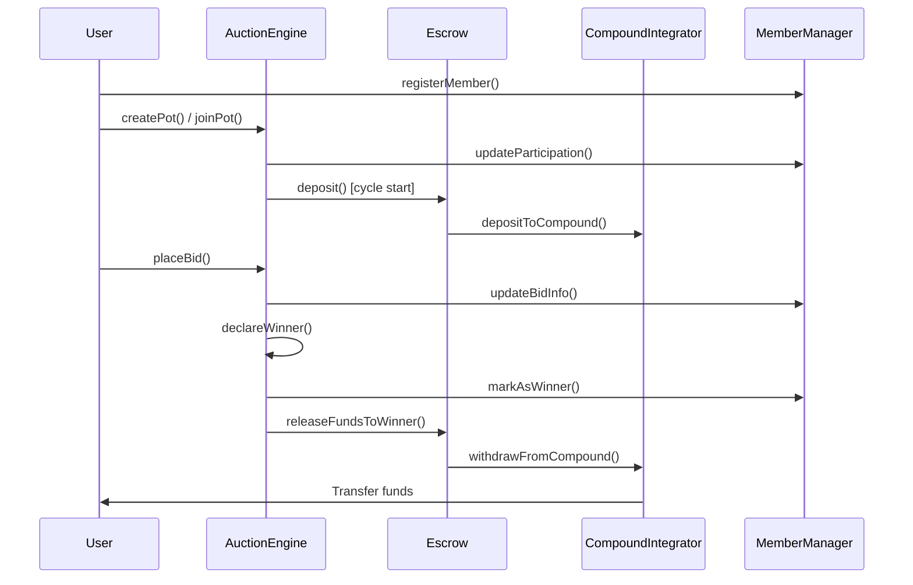

# ChainPot - Decentralized ROSCA Platform


**ChainPot** is a decentralized Rotating Savings and Credit Association (ROSCA) platform built on blockchain technology. It modernizes traditional chitfund systems by introducing transparency, automated payouts, and yield generation through DeFi integration.

## What is ROSCA?

A **Rotating Savings and Credit Association** is a group-based financial instrument where members regularly contribute to a common fund. In each cycle, one member receives the entire pooled amount based on bidding (lowest bid wins). This continues until all members have received their turn, combining savings with credit access.

## Architecture Overview

ChainPot consists of five interconnected smart contracts that handle different aspects of the ROSCA lifecycle:

```
┌─────────────────┐    ┌─────────────────┐    ┌─────────────────┐
│  AuctionEngine  │────│ MemberAccount   │────│  LotteryEngine  │
│   (Core Logic)  │    │   Manager       │    │  (Randomness)   │
└─────────────────┘    └─────────────────┘    └─────────────────┘
         │                       │                       │
         └───────────────────────┼───────────────────────┘
                                 │
         ┌─────────────────┐    │    ┌─────────────────┐
         │     Escrow      │────┼────│   CompoundV3    │
         │ (Fund Management)│         │   Integrator    │
         └─────────────────┘         └─────────────────┘
```

### Contract Responsibilities

- **AuctionEngine**: Manages pot creation, cycles, bidding, and winner selection
- **Escrow**: Handles fund deposits, withdrawals, and payout distribution
- **CompoundV3Integrator**: Generates yield by investing idle funds in Compound III
- **MemberAccountManager**: Tracks user participation, reputation, and performance
- **LotteryEngine**: Provides cryptographically secure random winner selection

## How ChainPot Works

### 1. Pot Creation & Joining
```solidity
// Creator sets up a new ROSCA pot
createPot(
    "Monthly Savings Circle",
    1 ether,           // Amount per cycle
    30 days,           // Cycle duration
    10,                // Total cycles
    CycleFrequency.Monthly,
    2 hours,           // Bid deadline
    5,                 // Min members
    10                 // Max members
);

// Others join the pot
joinPot(potId);
```

### 2. Cycle Execution Flow

1. **Deposit Phase**: All members contribute the agreed amount
2. **Bidding Phase**: Members bid for the right to receive funds (lowest bid wins)
3. **Winner Selection**: Either lowest bidder wins or random selection if no bids
4. **Fund Distribution**: Winner receives their amount, interest distributed to others
5. **Yield Generation**: Idle funds earn yield through Compound III integration

### 3. Automated Payout Structure

- **Winner receives**: Their winning bid amount (or full amount if lottery)
- **Others receive**: Proportional share of remaining interest + compound yield
- **Platform**: Sustainable through yield generation, not fees

## Key Features

### 🔐 **Transparency & Trust**
- All transactions recorded on blockchain
- Smart contract automation eliminates middlemen
- Real-time tracking of contributions and payouts

### 💰 **Yield Generation**
- Idle funds automatically invested in Compound III
- Members earn interest on contributions while waiting their turn
- No platform fees - sustained by DeFi yields

### 🎲 **Fair Winner Selection**
- Auction-based: Lowest bidder wins (incentivizes fair pricing)
- Lottery fallback: Cryptographically secure randomness via Pyth Network
- Prevents manipulation and ensures fairness

### 📊 **Reputation System**
- Track member reliability and participation history
- Reputation scores affect future pot access
- Performance metrics for informed decision making

### 🛡️ **Security Features**
- ReentrancyGuard protection on all critical functions
- Multi-signature admin controls
- Emergency pause and withdrawal mechanisms

## Contract Interactions

### Typical User Flow


## Deployment Guide

### Prerequisites
- Node.js v16+
- Hardhat or Foundry
- Base Sepolia testnet access
- USDC and ETH for testing

### Environment Setup
```bash
# Clone repository
git clone https://github.com/web3spell/chainpot
cd chainpot

# Install dependencies
npm install

# Configure environment
cp .env.example .env
# Add your private keys, RPC URLs, etc.
```

### Contract Addresses (Base Sepolia)
```javascript
const contracts = {
  COMET_USDC: "0x571621Ce60Cebb0c1D442B5afb38B1663C6Bf017",
  USDC: "0x036CbD53842c5426634e7929541eC2318f3dCF7e",
  PYTH_ENTROPY: "0x..." // Add Pyth Entropy address
};
```

### Deployment Order
1. **LotteryEngine** (requires Pyth Entropy)
2. **MemberAccountManager**
3. **CompoundV3Integrator** (requires Chainlink price feeds)
4. **Escrow** (requires CompoundIntegrator)
5. **AuctionEngine** (requires all above contracts)

### Basic Deployment Script
```javascript
// Deploy in correct order with proper linking
const lottery = await LotteryEngine.deploy(ENTROPY, ENTROPY_PROVIDER);
const memberManager = await MemberAccountManager.deploy();
const compoundIntegrator = await CompoundV3Integrator.deploy(ETH_USD_FEED, USDC_USD_FEED);
const escrow = await Escrow.deploy(USDC, compoundIntegrator.address);
const auctionEngine = await AuctionEngine.deploy(
  memberManager.address,
  lottery.address,
  escrow.address
);

// Set cross-references
await escrow.setAuctionEngine(auctionEngine.address);
await compoundIntegrator.setEscrow(escrow.address);
await memberManager.addAuthorizedCaller(auctionEngine.address);
```

## Security Considerations

### Auditing Checklist
- [ ] Reentrancy protection on all fund transfers
- [ ] Access control for admin functions
- [ ] Input validation on all public functions
- [ ] Emergency pause mechanisms
- [ ] Oracle price manipulation protection
- [ ] Integer overflow protection (Solidity 0.8+)

## Testing Snapshot 


### Known Limitations
- Current ETH/USDC conversion is simulated (production needs DEX integration)
- Chainlink price feed staleness checks implemented
- Emergency withdrawal functions for edge cases


## Contributing

We welcome contributions! Please read our [Contributing Guidelines](CONTRIBUTING.md) and submit PRs for:

- Bug fixes and optimizations
- Additional yield strategies
- Frontend improvements
- Documentation enhancements
- Test coverage expansion

## License

This project is licensed under the MIT License - see the [LICENSE](LICENSE) file for details.

---

**Disclaimer**: ChainPot is experimental software. Users should understand the risks involved with DeFi protocols and smart contracts. 
