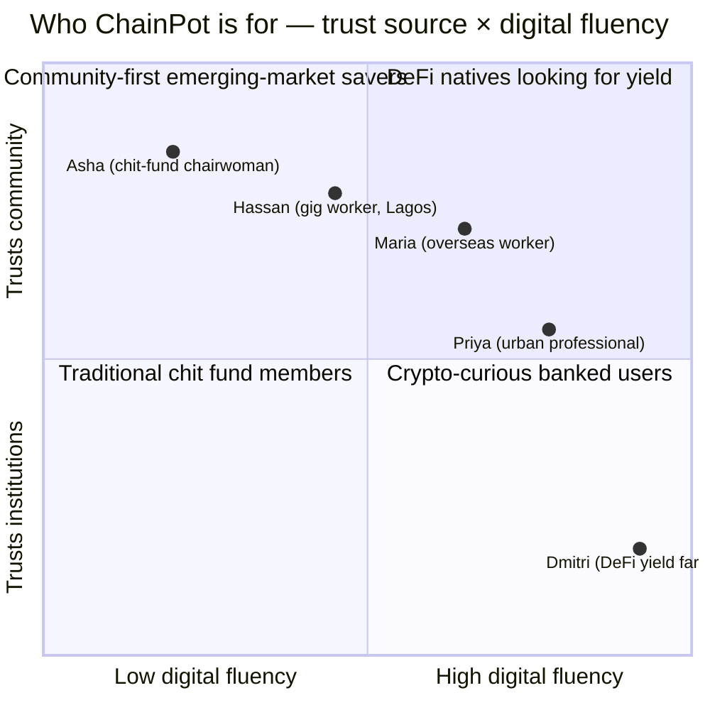
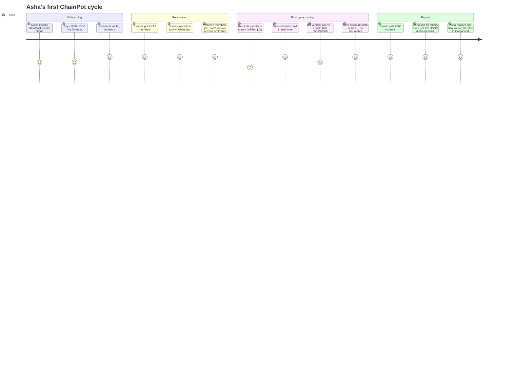
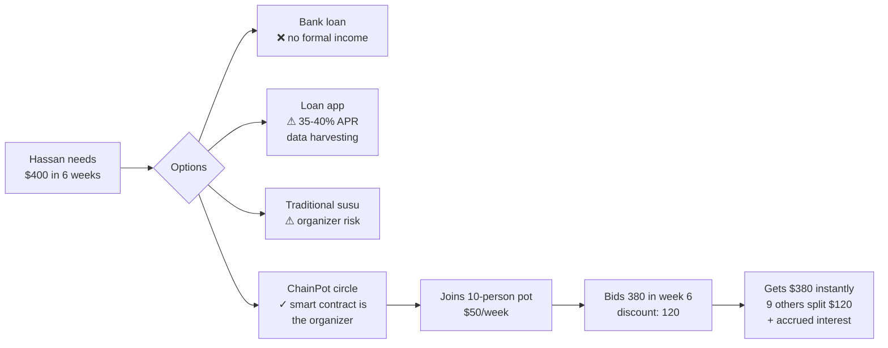
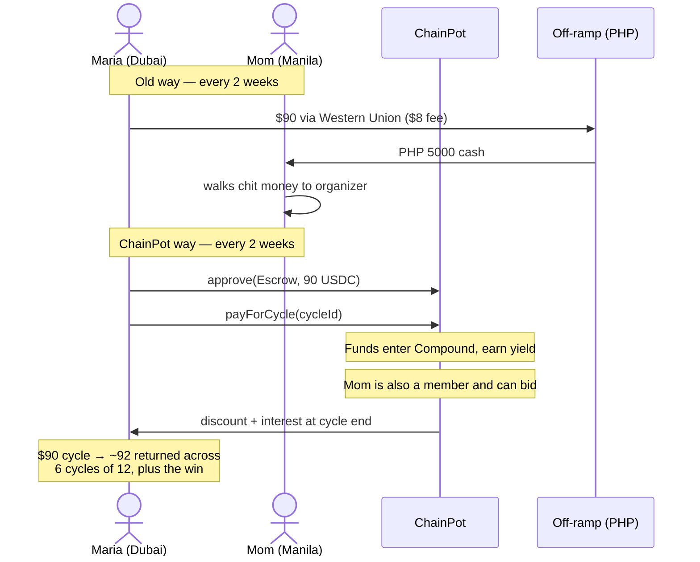
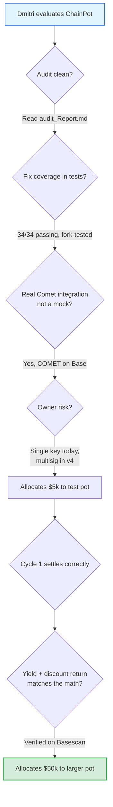
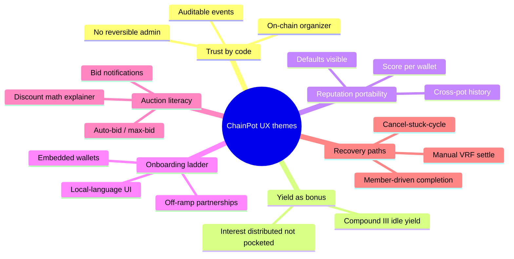

# ChainPot — User Personas

> Who we're building for. Five archetypes drawn from the people who already run rotating savings circles by the millions, and the people who would join one if they could trust it.

This document exists to keep design decisions honest. Every protocol parameter, every UI affordance, every cycle of the contract has to make sense for at least one of the people described here. If a feature can't be tied to a real person's actual problem, it's noise.

---

## Persona at-a-glance

The personas span the diagonal from `(low fluency, high community trust)` — the traditional chit-fund chairwoman — to `(high fluency, low community trust)` — the DeFi yield farmer who joins a circle for the auction discount, not the social contract. ChainPot has to feel native to both ends.

---

## Persona 1 — Asha Pillai

> *"My mother ran a chit. My aunties ran chits. I run a chit. The phone is new but the *kuri* is old."*

**Profile:** 47, Chennai, India. Owns a small saree-export business. Married, two kids. WhatsApp daily, mobile banking for last 3 years, never used a DeFi app. Speaks Tamil and English. Smartphone is mid-range Android.

**Why she's here:** She organizes a 20-person *kuri* among her cousins, neighbours, and a few customers. Last cycle, one member skipped a payment for two months, another disputed the bid-discount math, and a third quietly suggested Asha was keeping the interest from her business account "as fees." She wants to keep doing this — it's how her extended family lives — but she's tired of being everyone's bookkeeper and suspect.

**Goals**
- Keep her family circle going without being the suspect.
- Earn a little yield on the float — she never got that with the cash version.
- Prove to her husband (skeptical) that this isn't crypto-gambling.

**Pain points with v3 today**
- ChainPot still requires a non-trivial wallet onboarding. We need a smart-account / passkey path.
- Reminders to pay are still off-chain (WhatsApp). We could ship a Push Protocol or XMTP notification on `MemberPaidForCycle` not firing by hour T-X.
- The discount-split UI exists but isn't in her native language.

**What ChainPot v3 does for her right now**
- `createPot` puts her name on the *organizer* line, immutably. No one can accuse her of dipping the till — every `payForCycle`, `releaseFundsToWinner`, and `distributeRemainderTo` is a public event.
- If a member defaults, `markAsDefaulter` on `MemberAccountManagerV3` decrements their reputation, visible to everyone who tries to onboard them into a new circle next year. (Slashing on collateral comes in v4.)
- Idle USDC earns Comet supply yield; non-winners receive that interest along with the discount in `completeCycle`. Asha didn't have to do anything to make that happen.

**Quote that should drive design:** *"I want the contract to be the boss, not me."*

---

## Persona 2 — Hassan Adebayo

> *"The bank wants three years of payslips. I drive a bike. I don't have payslips. I have a phone and people who know me."*

**Profile:** 26, Lagos, Nigeria. Bolt driver and part-time fashion photographer. Single. Pays in Naira but holds USDT/USDC for savings (inflation is brutal). Active on Telegram and X. Has used DEXes on Polygon a couple of times.

**Why he's here:** He needs ~₦600,000 (~$400) for camera equipment. He's already in two *ajo* (susu) circles run by neighbourhood organizers, and one of them collapsed in 2024 when the organizer "lost the money." He wants the credit access of a susu without the organizer risk.

**Goals**
- Get a single liquidity injection without an interest rate that ruins him.
- Build an on-chain reputation he can re-use (rep score moves with his wallet).
- Stay in stables — he doesn't want exposure to ETH or BTC.

**Pain points with v3 today**
- Onboarding: he can do MetaMask, but he wants account abstraction. We should add an embedded-wallet option (Privy, Dynamic, or Coinbase Smart Wallet).
- The lowest-bid auction is unfamiliar to him — his susus rotate by lot. We need a "bidding tutorial" in the UI that explains why bidding low helps him *and* the group.
- Bid window UX. He drives during the bidding hours and might miss it. We need on-chain "set max bid in advance" — currently bids are settable any time pre-deadline, but require a wallet touch.

**What ChainPot v3 does for him right now**
- Eliminates the organizer-disappears risk. Funds custody is `EscrowV3` and `CompoundIntegratorV3` — no human signer can drain.
- His reputation score persists across pots. If he completes 3 cycles without default, he can be invited to higher-stake pots.
- VRF lottery fallback (H-05 fix) means even a no-bid pot resolves fairly — randomness is auditable.

**Quote that should drive design:** *"Show me the smart contract address on Basescan. That's my proof."*

---

## Persona 3 — Maria Reyes

> *"I send money home every two weeks. My mother runs a paluwagan with our neighbours. I want to send my contribution and earn a little while I wait my turn."*

**Profile:** 34, OFW (Overseas Filipino Worker) in Dubai. Domestic helper. Sends ~$800/month to Manila. Filipino, decent English, no crypto experience but heard about it from cousins.

**Why she's here:** Her family in Manila runs a 12-person *paluwagan* contributing PHP 5000/cycle (~$90). Maria contributes too, but the cash-in-hand model means her mother fronts her share and she pays Western Union to remit, losing $8 per transfer. A USDC-denominated chit on Base means her remittance and her chit contribution are the same transaction.

**Goals**
- Lower remittance friction.
- Earn yield her bank account doesn't pay (UAE banks pay ~0.5%).
- Stay involved in family financial life despite living abroad.

**Pain points with v3 today**
- She can't bid from Dubai during Manila bid hours without an alarm. **Auto-bid / max-bid** is a critical feature.
- USDC → PHP off-ramp on Base is thin. We need a partner like Onmeta or Transak with PH coverage.
- She'd want to track her mother's wallet activity easily — a "linked family member" view.

**What ChainPot v3 does for her right now**
- USDC settlement on Base costs cents instead of $8 per remittance leg.
- Yield while idle in Compound — `getCycleInterest` is non-zero for the entire holding period.
- Cycle accounting (C-02 fix) is mathematically correct: she will not be silently shorted because someone else's cycle is interfering with her interest share.

**Quote that should drive design:** *"I want my mother to use it. If she can't, it doesn't matter how good it is."*

---

## Persona 4 — Dmitri Volkov

> *"Show me the APY and the protocol risk. I'll decide if I want in. I don't need a kuumbaya circle."*

**Profile:** 29, Berlin (originally Saint Petersburg). Software engineer. Holds roughly 200k USDC across Compound, Aave, Morpho. Reads Solidity. Has been rugged twice and gunned shot for Curve-war farms.

**Why he's here:** He's looking for non-correlated USDC yield. ChainPot's structure interests him: he can join a pot, bid aggressively for an early payout (taking a chunky discount cost), or bid never (collecting discount + interest from other people's early-cash-out tax). Either way, the math has to work out.

**Goals**
- Diversified USDC yield that isn't another lending market.
- A clean accounting model he can verify on-chain (shares math, not "trust us we calculated it").
- Predictable, capped downside.

**Pain points with v3 today**
- Single owner. He flags M-05 immediately — owner key compromise = total loss. Will probably wait for the v4 timelock/multisig.
- No formal verification yet. He's pickier than most.
- Pot duration is currently capped at `cycleCount * cycleDuration ≤ ~3 years`. He'd prefer indefinite-duration "perpetual pots" where the cycle order rotates with reputation.

**What ChainPot v3 does for him right now**
- ERC4626-style share accounting (C-02 fix) is the same primitive he already trusts from Yearn/ERC4626 vaults.
- Compound III integration is direct (`supply` / `withdraw` / `balanceOf`), no wrapper risk.
- Every fix in the audit comes with an integration test he can re-run himself.

**Quote that should drive design:** *"If your accounting can't be unit-tested as an ERC4626 vault, your accounting is wrong."*

---

## Persona 5 — Priya Sharma

> *"I have an investment app and a savings account. I'm not desperate for credit. I want to save with discipline and earn a little more than my FD."*

**Profile:** 31, Bengaluru, India. Product manager at a SaaS company. ₹2.5 LPA disposable savings. Banked, has an investment app (Zerodha + Coin), tried buying ETH on WazirX in 2023.

**Why she's here:** Her parents ran chits. She likes the discipline of the recurring contribution — she's tried automating mutual fund SIPs but always has the option to cancel mid-month. A ROSCA's social-contract enforcement is what she wants, but the cash version was opaque. ChainPot's transparency means she can finally show her dad a chit she trusts.

**Goals**
- Forced-savings vehicle with a discount upside.
- Auditable, transparent, compliant-feeling — she's not breaking any rules with a Base Sepolia experiment.
- Onboard her parents eventually (a v5 problem).

**Pain points with v3 today**
- No tax reporting. She'd want a CSV of `MemberPaidForCycle` + `RemainderDistributed` events for her CA.
- Indian off-ramp uncertainty. She's holding USDC bought via P2P. We need a clear path.
- App-store-quality UX — she expects polish that DeFi often doesn't deliver.

**What ChainPot v3 does for her right now**
- A correctly-implemented ROSCA — the only one she trusts where the math is on-chain.
- Reputation score builds across pots and is portable; she likes that her track record follows her wallet.

**Quote that should drive design:** *"If this had a CSV export and didn't say 'gas fee' in the UI, my dad would use it."*

---

## Cross-cutting themes

### What every persona shares
1. **They don't want a "DeFi product." They want a chit fund that works.** The protocol should disappear behind the UX.
2. **They want to know exactly who and what controls their money at every step.** The audit report and on-chain transparency aren't marketing — they're the product.
3. **They want recovery paths when something goes wrong.** v3 has `cancelStuckVRFCycle`, member-driven `closeBidding` / `completeCycle`, and emergency pause. These need to be surfaced in the UI before a user hits them.
4. **They want their reputation to follow them.** No persona above is satisfied with "this account is anonymous." They want their behaviour in one circle to matter in the next.

### What divides them
- **Bidding behaviour.** Dmitri bids aggressively for yield, Hassan bids only when he needs liquidity, Asha rarely bids and prefers lottery rotation. The protocol supports all three.
- **Onboarding ceiling.** Asha and Maria need embedded wallets and local fiat ramps; Dmitri brings his own wallet. We need both paths.
- **Notification surface.** Asha wants WhatsApp messages; Dmitri wants webhooks. The events are there — the surfacing is the work.

---

## Anti-personas — who we're explicitly NOT building for

| Anti-persona | Why excluded |
|---|---|
| Yield-chasing aggregators looking for the highest single-protocol APY | ChainPot's yield is supplementary, not headline. We'll lose every comparison vs. lending markets. |
| Predatory loan-app users looking for instant disbursement | Pots require members and time; an instant-credit story would lie. |
| Anonymous-mixer adjacent users | We deliberately track participation history on-chain. Anonymity is incompatible with the reputation model. |
| Speculative-token traders | No ChainPot token will exist, by design — see roadmap. |

---

## How this document gets used

1. Every PR that adds a user-facing feature must cite which persona's goal it serves. If it cites none, it probably doesn't ship.
2. Roadmap items are pruned by re-reading this doc — features that don't appear in any persona's "pain points with v3 today" are deprioritized.
3. We add personas when we learn about real users. We remove them when we discover they were imagined, not observed.

— ChainPot product team, gamma branch
