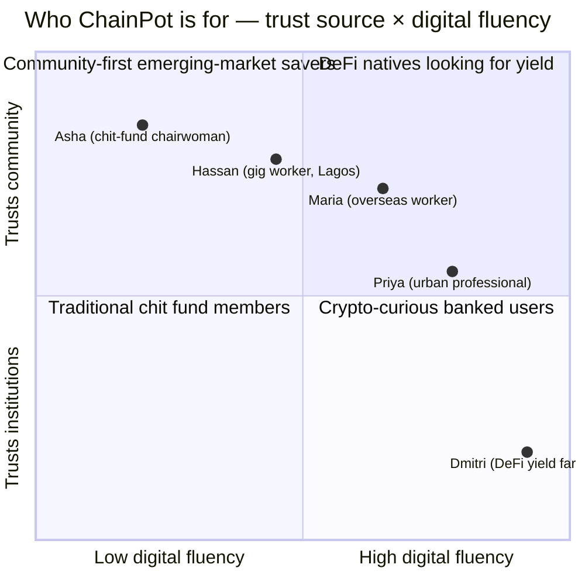
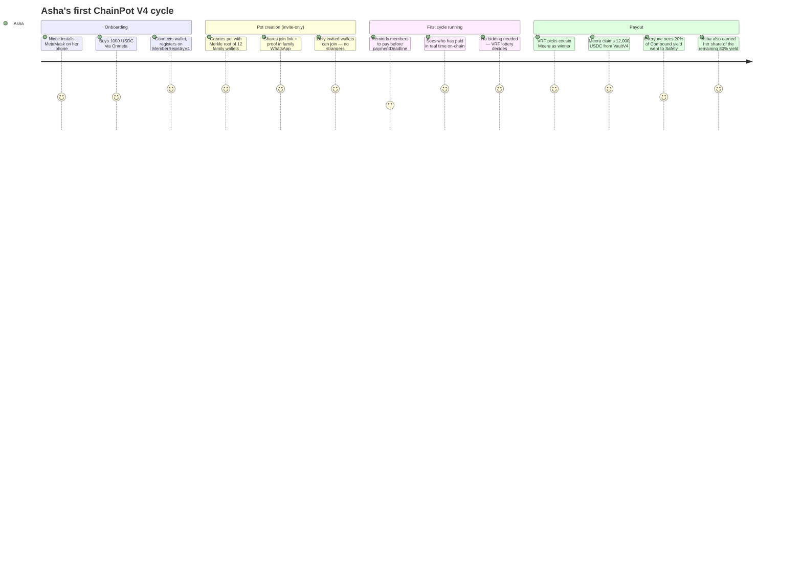
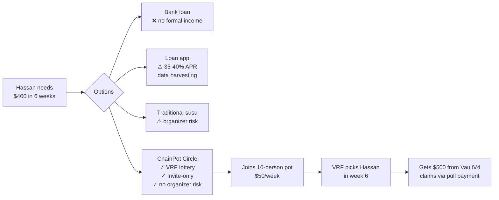
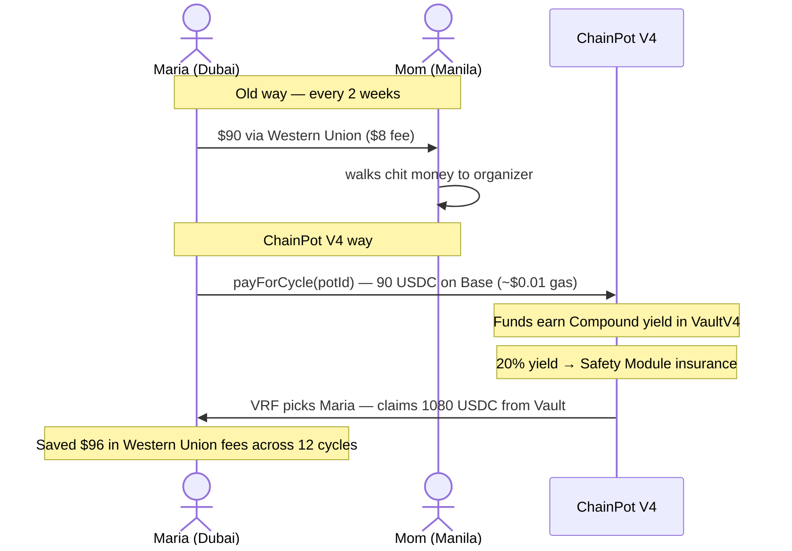
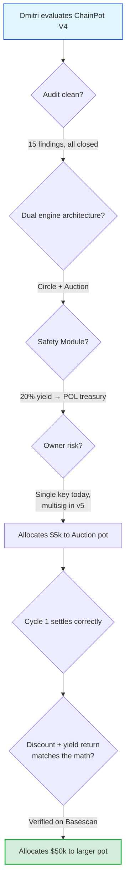
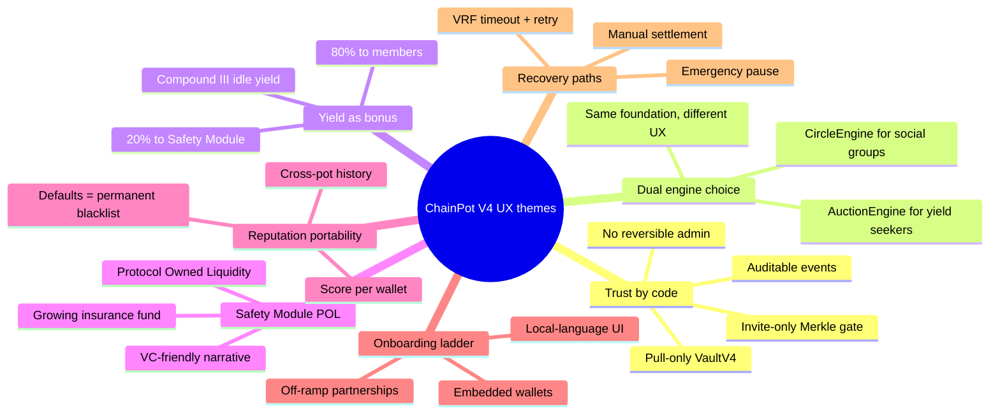

# ChainPot — User Personas

> Who we're building for. Five archetypes drawn from the people who already run rotating savings circles by the millions, and the people who would join one if they could trust it.

This document exists to keep design decisions honest. Every protocol parameter, every UI affordance, every cycle of the contract has to make sense for at least one of the people described here. If a feature can't be tied to a real person's actual problem, it's noise.

---

## Persona at-a-glance

The personas span the diagonal from `(low fluency, high community trust)` — the traditional chit-fund chairwoman — to `(high fluency, low community trust)` — the DeFi yield farmer who joins a circle for the auction discount, not the social contract. ChainPot has to feel native to both ends.

**V4 key change:** With the dual-engine architecture, each persona now maps to a specific engine:
- **Asha, Hassan, Maria** → **CircleEngineV4** (lottery / kitty party) — simple, fair, social
- **Dmitri** → **AuctionEngineV4** (discount auction / business ROSCA) — yield-optimized, strategic
- **Priya** → Either engine depending on her group

---

## Persona 1 — Asha Pillai

> *"My mother ran a chit. My aunties ran chits. I run a chit. The phone is new but the *kuri* is old."*

**Profile:** 47, Chennai, India. Owns a small saree-export business. Married, two kids. WhatsApp daily, mobile banking for last 3 years, never used a DeFi app. Speaks Tamil and English. Smartphone is mid-range Android.

**Why she's here:** She organizes a 20-person *kuri* among her cousins, neighbours, and a few customers. Last cycle, one member skipped a payment for two months, another disputed the bid-discount math, and a third quietly suggested Asha was keeping the interest from her business account "as fees." She wants to keep doing this — it's how her extended family lives — but she's tired of being everyone's bookkeeper and suspect.

**V4 engine: CircleEngineV4 (Program A — Lottery)**

Asha doesn't want auctions. She wants a simple, fair rotation. Chainlink VRF gives her exactly that — provably random, no accusations of favoritism.

**Goals**
- Keep her family circle going without being the suspect.
- Earn a little yield on the float — she never got that with the cash version.
- Prove to her husband (skeptical) that this isn't crypto-gambling.
- **V4:** Control exactly who enters her pot. The Merkle invite gate means she curates the roster and no stranger can sneak in.

**Pain points — what V4 solved**
- ✅ **Organizer accusations eliminated.** VaultV4 is pull-only. Asha literally cannot touch anyone's funds. Every deposit, winner credit, and claim is a public on-chain event.
- ✅ **Default deterrence.** If cousin Ravi doesn't pay by `paymentDeadline`, the contract marks him as `defaulted` and his `MemberRegistryV4` reputation is permanently slashed. He's blacklisted from future pots protocol-wide.
- ✅ **Interest fairness.** 20% of Compound yield goes to the ChainPot Safety Module (protocol insurance), 80% is distributed to members. No accusations of Asha pocketing interest.
- ✅ **Invite-only roster.** Merkle root means only the wallets Asha whitelists can join. The roster freezes at `startPot()` — no late additions, no removals.

**Remaining pain points**
- ChainPot still requires a non-trivial wallet onboarding. We need a smart-account / passkey path.
- Reminders to pay are still off-chain (WhatsApp). We could ship Push Protocol notifications on payment deadline approach.
- The UI isn't in her native language yet.

**Quote that should drive design:** *"I want the contract to be the boss, not me."*

---

## Persona 2 — Hassan Adebayo

> *"The bank wants three years of payslips. I drive a bike. I don't have payslips. I have a phone and people who know me."*

**Profile:** 26, Lagos, Nigeria. Bolt driver and part-time fashion photographer. Single. Pays in Naira but holds USDT/USDC for savings (inflation is brutal). Active on Telegram and X. Has used DEXes on Polygon a couple of times.

**Why he's here:** He needs ~₦600,000 (~$400) for camera equipment. He's already in two *ajo* (susu) circles run by neighbourhood organizers, and one of them collapsed in 2024 when the organizer "lost the money." He wants the credit access of a susu without the organizer risk.

**V4 engine: CircleEngineV4 (Program A — Lottery)**

Hassan's social circles use lottery-based rotation (not auctions). CircleEngineV4 gives him the exact same experience as his neighbourhood *ajo*, but the smart contract is the organizer.

**Goals**
- Get a single liquidity injection without an interest rate that ruins him.
- Build an on-chain reputation he can re-use (rep score moves with his wallet).
- Stay in stables — he doesn't want exposure to ETH or BTC.

**What V4 does for Hassan**
- ✅ **Organizer-disappears risk = zero.** Fund custody is `VaultV4` — no human signer can drain.
- ✅ **Reputation portability.** His `MemberRegistryV4` score persists across pots. 3 completed cycles = invited to higher-stake pots.
- ✅ **Invite-only trust.** His friend creates the pot with a Merkle whitelist. No random internet strangers can join and default.
- ✅ **Safety Module.** Even if someone defaults, the growing treasury backstop gives him peace of mind.

**Remaining pain points**
- Account abstraction / embedded wallet (Privy, Coinbase Smart Wallet) for smoother onboarding.
- On-chain "set max bid in advance" for the AuctionEngine path (if he ever uses Program B).

**Quote that should drive design:** *"Show me the smart contract address on Basescan. That's my proof."*

---

## Persona 3 — Maria Reyes

> *"I send money home every two weeks. My mother runs a paluwagan with our neighbours. I want to send my contribution and earn a little while I wait my turn."*

**Profile:** 34, OFW (Overseas Filipino Worker) in Dubai. Domestic helper. Sends ~$800/month to Manila. Filipino, decent English, no crypto experience but heard about it from cousins.

**Why she's here:** Her family in Manila runs a 12-person *paluwagan* contributing PHP 5000/cycle (~$90). Maria contributes too, but the cash-in-hand model means her mother fronts her share and she pays Western Union to remit, losing $8 per transfer. A USDC-denominated chit on Base means her remittance and her chit contribution are the same transaction.

**V4 engine: CircleEngineV4 (Program A — Lottery)**

Her family's paluwagan is a lottery rotation. CircleEngineV4 maps directly.

**Goals**
- Lower remittance friction.
- Earn yield her bank account doesn't pay (UAE banks pay ~0.5%).
- Stay involved in family financial life despite living abroad.

**What V4 does for Maria**
- ✅ USDC settlement on Base costs cents instead of $8 per remittance leg.
- ✅ Compound yield while idle — and she can see the Safety Module TVL growing as insurance.
- ✅ Cycle accounting (ERC4626 shares) is mathematically correct: she will not be silently shorted.
- ✅ Invite-only means her mother's neighbourhood group stays closed to trusted members only.

**Remaining pain points**
- USDC → PHP off-ramp on Base is thin. We need a partner like Onmeta or Transak with PH coverage.
- Auto-bid / max-bid for the Auction engine path (timezone difference).
- "Linked family member" view in the frontend.

**Quote that should drive design:** *"I want my mother to use it. If she can't, it doesn't matter how good it is."*

---

## Persona 4 — Dmitri Volkov

> *"Show me the APY and the protocol risk. I'll decide if I want in. I don't need a kuumbaya circle."*

**Profile:** 29, Berlin (originally Saint Petersburg). Software engineer. Holds roughly 200k USDC across Compound, Aave, Morpho. Reads Solidity. Has been rugged twice and gunned shot for Curve-war farms.

**Why he's here:** He's looking for non-correlated USDC yield. ChainPot's structure interests him: he can join a pot, bid aggressively for an early payout (taking a chunky discount cost), or bid never (collecting discount + interest from other people's early-cash-out tax). Either way, the math has to work out.

**V4 engine: AuctionEngineV4 (Program B — Auction)**

Dmitri wants the discount auction. He's not here for social vibes — he's here for yield math.

**Goals**
- Diversified USDC yield that isn't another lending market.
- A clean accounting model he can verify on-chain (ERC4626 shares math, not "trust us we calculated it").
- Predictable, capped downside.

**What V4 does for Dmitri**
- ✅ **AuctionEngineV4** gives him exactly the mechanics he wants: lowest-bid discount auction with strict enforcement (2% min step, strictly-lower re-bids, `totalCollected` ceiling).
- ✅ **ERC4626-style share accounting** in CompoundIntegratorV4 — the same primitive he trusts from Yearn.
- ✅ **Safety Module (POL)** — he can point VCs to a growing insurance fund that mathematically backstops the protocol.
- ✅ **Pull-only VaultV4** — no admin can drain. `rescueSurplus` is timelocked and surplus-only.
- ✅ Every audit fix ships with a Foundry test he can re-run.

**Remaining pain points**
- Single owner key. He'll wait for multisig + timelock (v5).
- No formal verification yet. He's pickier than most.
- Would prefer "perpetual pots" with indefinite rotation.

**Quote that should drive design:** *"If your accounting can't be unit-tested as an ERC4626 vault, your accounting is wrong."*

---

## Persona 5 — Priya Sharma

> *"I have an investment app and a savings account. I'm not desperate for credit. I want to save with discipline and earn a little more than my FD."*

**Profile:** 31, Bengaluru, India. Product manager at a SaaS company. ₹2.5 LPA disposable savings. Banked, has an investment app (Zerodha + Coin), tried buying ETH on WazirX in 2023.

**Why she's here:** Her parents ran chits. She likes the discipline of the recurring contribution — she's tried automating mutual fund SIPs but always has the option to cancel mid-month. A ROSCA's social-contract enforcement is what she wants, but the cash version was opaque. ChainPot's transparency means she can finally show her dad a chit she trusts.

**V4 engine: Either — depends on her group.**

For her office colleagues: CircleEngineV4 (simple, fun lottery). For her investment club: AuctionEngineV4 (strategic, yield-generating).

**Goals**
- Forced-savings vehicle with a discount upside.
- Auditable, transparent, compliant-feeling.
- Onboard her parents eventually.

**What V4 does for Priya**
- ✅ **Dual engine choice.** She picks the engine that fits her group's vibe. Office kitty party? Circle (lottery). Investment club? Auction (discount bids).
- ✅ **Invite-only.** She creates a Merkle whitelist of her 8 office colleagues. Nobody from crypto Twitter can join and default.
- ✅ **Safety Module.** She can show her dad the growing insurance fund — "see, the protocol is building a safety net automatically."
- ✅ **Reputation portability.** Her `MemberRegistryV4` score follows her wallet across pots.

**Remaining pain points**
- No tax reporting. She'd want a CSV of events for her CA.
- Indian off-ramp uncertainty.
- App-store-quality UX polish.

**Quote that should drive design:** *"If this had a CSV export and didn't say 'gas fee' in the UI, my dad would use it."*

---

## Cross-cutting themes

### What every persona shares
1. **They don't want a "DeFi product." They want a chit fund that works.** The protocol should disappear behind the UX.
2. **They want to know exactly who and what controls their money at every step.** The audit report and on-chain transparency aren't marketing — they're the product.
3. **They want recovery paths when something goes wrong.** V4 has VRF timeout with retry logic, member-driven cycle completion, and emergency pause. These need to be surfaced in the UI before a user hits them.
4. **They want their reputation to follow them.** No persona above is satisfied with "this account is anonymous." They want their behaviour in one circle to matter in the next.
5. **V4: They want to know their money is insured.** The Safety Module (20% yield capture) gives every persona peace of mind — from Asha ("what if someone defaults?") to Dmitri ("what's the protocol's risk backstop?").

### What divides them
- **Engine preference.** Asha, Hassan, Maria → CircleEngine (lottery). Dmitri → AuctionEngine (discount auction). Priya → either, depending on her group.
- **Onboarding ceiling.** Asha and Maria need embedded wallets and local fiat ramps; Dmitri brings his own wallet. We need both paths.
- **Notification surface.** Asha wants WhatsApp messages; Dmitri wants webhooks. The events are there — the surfacing is the work.

---

## Anti-personas — who we're explicitly NOT building for

| Anti-persona | Why excluded |
|---|---|
| Yield-chasing aggregators looking for the highest single-protocol APY | ChainPot's yield is supplementary, not headline. We'll lose every comparison vs. lending markets. |
| Predatory loan-app users looking for instant disbursement | Pots require members and time; an instant-credit story would lie. |
| Anonymous-mixer adjacent users | We deliberately track participation history on-chain. Anonymity is incompatible with the reputation model. |
| Speculative-token traders | No ChainPot token will exist, by design — see roadmap. |
| Users who want collateral-free anonymous access | V4's model is invite-only with social trust. Open, anonymous access would break the security model. |

---

## How this document gets used

1. Every PR that adds a user-facing feature must cite which persona's goal it serves. If it cites none, it probably doesn't ship.
2. Roadmap items are pruned by re-reading this doc — features that don't appear in any persona's pain points are deprioritized.
3. **V4 addition:** Every new feature must also specify which engine it applies to (Circle, Auction, or both).
4. We add personas when we learn about real users. We remove them when we discover they were imagined, not observed.

— ChainPot product team, V4
